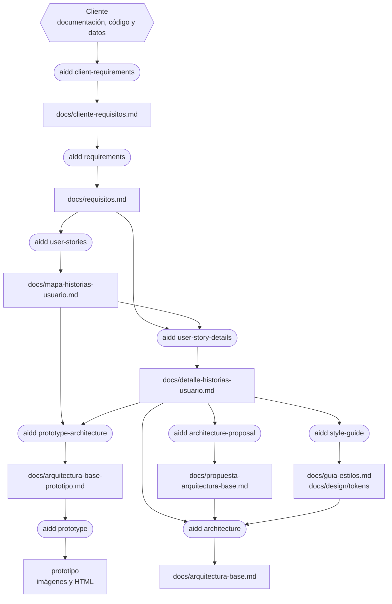
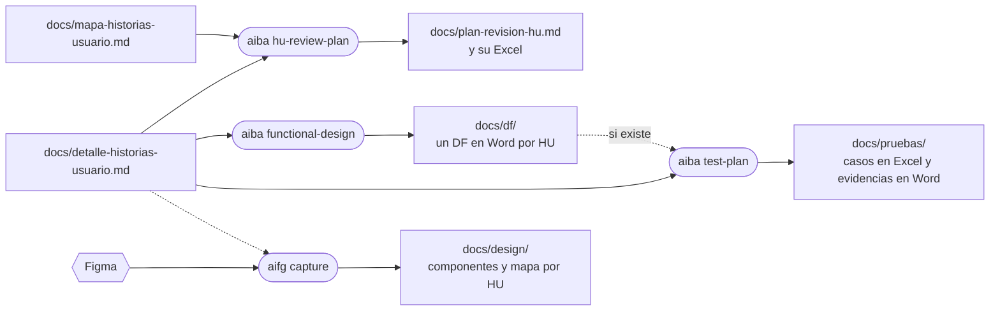
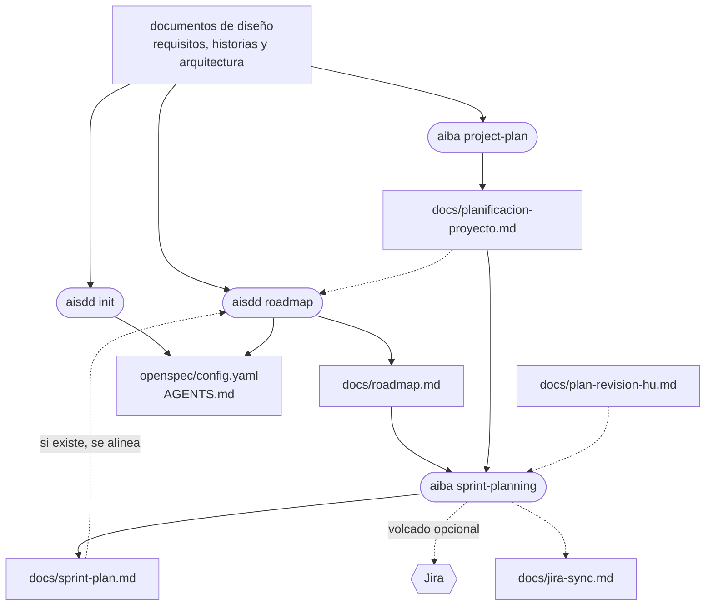
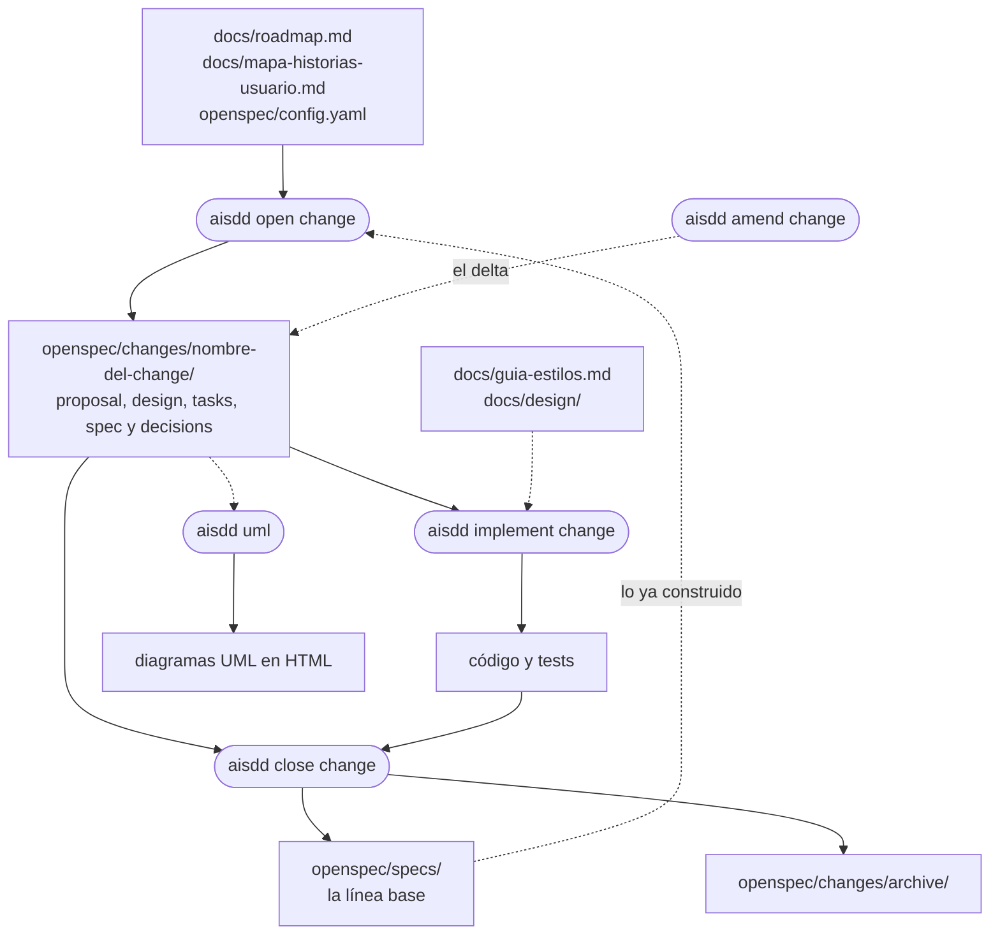
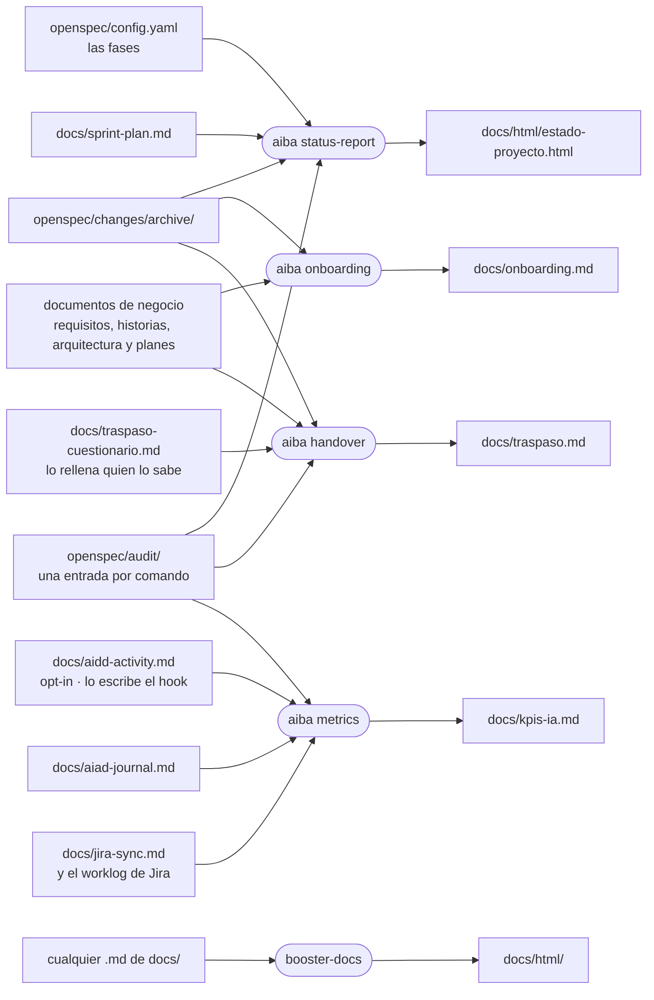

# Artefactos

**¿Qué documento sale de cada paso y quién lo lee después?** Es lo que explica el orden del proceso: cada comando lee lo que dejó el anterior. Cinco diagramas, uno por tramo, y al final la tabla de quién escribe y quién lee cada fichero.

En los diagramas, el **rectángulo** es un fichero, la **píldora** es un comando y el **hexágono** es algo de fuera del repo.

## Definir y diseñar

## Lo que se entrega a negocio y a QA

## Planificar

## Construir

Los tres comandos del change escriben además su entrada en `openspec/audit/` y, con Jira activo, actualizan `docs/jira-sync.md`.

## Medir y contar

## Quién escribe y quién lee cada fichero

| Fichero | Lo escribe | Lo leen |
|---|---|---|
| `docs/cliente-requisitos.md` | `aidd client-requirements` | `aidd requirements`, `aidd prototype`, `aiba onboarding`, `aiba handover` |
| `docs/requisitos.md` | `aidd requirements` | `aidd user-stories`, `aidd user-story-details`, `aisdd init` |
| `docs/mapa-historias-usuario.md` | `aidd user-stories` | `aidd user-story-details`, `aidd prototype-architecture`, `aiba hu-review-plan`, `aiba project-plan`, `aiba onboarding`, `aisdd open change` |
| `docs/detalle-historias-usuario.md` | `aidd user-story-details` | Casi todos: la Fase 2 de `aidd`, los documentos, planes y métricas de `aiba`, `aisdd init` y `aisdd roadmap`, y `aifg` |
| `docs/arquitectura-base-prototipo.md` | `aidd prototype-architecture` | `aidd prototype` |
| `docs/guia-estilos.md` | `aidd style-guide` | `aidd architecture`, `aisdd implement change`, `aifg`, `aiba onboarding`, `aiba handover` |
| `docs/design/` | `aidd style-guide` (los tokens) y `aifg capture` (componentes y mapa por HU) | `aisdd implement change`, `aifg update`, `aiba handover` |
| `docs/propuesta-arquitectura-base.md` | `aidd architecture-proposal` | `aidd architecture` |
| `docs/arquitectura-base.md` | `aidd architecture` | `aisdd init`, `aisdd roadmap`, `aiba project-plan`, `aiba onboarding`, `aiba handover` |
| `docs/plan-revision-hu.md` | `aiba hu-review-plan` | `aiba sprint-planning`, `aisdd init`, `aisdd roadmap`, `aiba onboarding` |
| `docs/df/` | `aiba functional-design` | `aiba test-plan`, `aiba handover`, y quien firma |
| `docs/pruebas/` | `aiba test-plan` | Quien ejecuta las pruebas |
| `docs/planificacion-proyecto.md` | `aiba project-plan` | `aiba sprint-planning`, `aisdd init`, `aisdd roadmap`, `aiba onboarding`, `aiba handover` |
| `docs/roadmap.md` | `aisdd roadmap` | `aiba sprint-planning`, `aisdd open change`, `aisdd lane`, `aiba handover` |
| `docs/sprint-plan.md` | `aiba sprint-planning` | `aisdd init`, `aisdd roadmap`, `aiba status-report`, `aiba onboarding` |
| `docs/jira-sync.md` | `aiba sprint-planning` al volcar, y `aisdd open`, `implement` y `close change` | Los mismos comandos, `aisdd amend change`, `aiba functional-design` y `aiba metrics` |
| `openspec/config.yaml` | `aisdd init` y `aisdd roadmap`; `aiba sprint-planning`, la sección de Jira | Todos los comandos de `aisdd`, `aiba status-report` |
| `openspec/changes/<change>/` | `aisdd open change`; `aisdd implement change` y `aisdd amend change` lo completan | `aisdd implement change`, `aisdd close change`, `aisdd uml` |
| `openspec/specs/` | `aisdd init` en un proyecto con código, y `aisdd close change` | `aisdd open change`, `aiba handover` |
| `openspec/changes/archive/` | `aisdd close change` | `aiba status-report`, `aiba onboarding`, `aiba handover` |
| `openspec/audit/` | Cada comando de `aisdd`, salvo `aisdd lane` | `aiba status-report`, `aiba metrics`, `aiba handover` |
| `docs/aidd-activity.md` | El hook de actividad, solo si el fichero existe | `aiba metrics` |
| `docs/aiad-journal.md` | `aiad journal` y su hook | `aiba metrics` |
| `docs/html/estado-proyecto.html` | `aiba status-report` | Comité y dirección |
| `docs/kpis-ia.md` | `aiba metrics` | Quien decide si la IA compensa |
| `docs/onboarding.md` | `aiba onboarding` | Quien se incorpora, y `aiba handover` |
| `docs/traspaso-cuestionario.md` | `aiba handover` lo prepara; lo rellena quien lo sabe | `aiba handover` |
| `docs/traspaso.md` | `aiba handover` | El equipo de mantenimiento |
| `docs/html/` | `booster-docs`, al que llaman los skills que generan documentos, y los informes de `aiba` | Personas: la vista HTML de cada documento; el `.md` sigue siendo la fuente |
