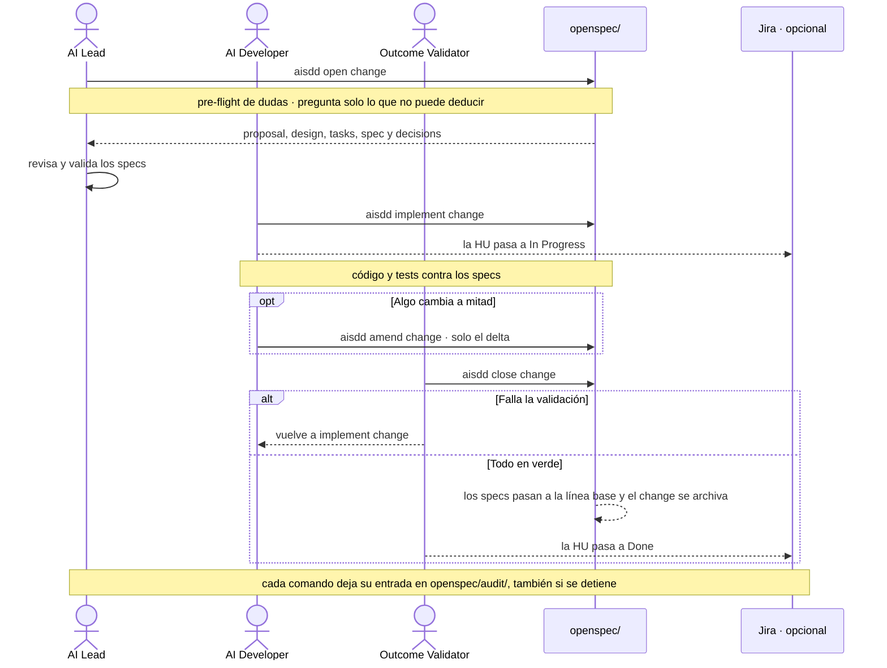

# Ciclo de un change

**¿Quién hace qué y qué queda escrito?** Un change es la unidad de trabajo de OpenSpec: realiza una o varias HU. Pasa por tres comandos, cada uno en manos de un rol, y todos dejan rastro.

## Qué deja cada paso

| Paso | Rol | Escribe | En Jira, si está activo |
|---|---|---|---|
| `aisdd open change` | AI Lead | `proposal.md`, `design.md`, `tasks.md`, los `spec.md` y `decisions.md` en `openspec/changes/<change>/` | Anota la HU del change en `docs/jira-sync.md`; no mueve nada |
| `aisdd implement change` | AI Developer | Código y tests; en `decisions.md`, lo que ningún documento fijaba | La HU a In Progress |
| `aisdd amend change` | AI Developer o AI Lead | El delta: criterios nuevos en `spec.md`, la decisión en `design.md`, las tareas, y su código | — |
| `aisdd close change` | Outcome Validator | Los `spec.md` pasan a `openspec/specs/` y el change a `openspec/changes/archive/` | La HU a Done; en modo sub-tarea, solo cuando todas sus sub-tareas lo están |

Todos escriben además una entrada en `openspec/audit/`, con estado `ok`, `partial` o `aborted`. De ahí salen [`aiba status-report`](../../plugins/aiba/skills/aiba-status-report/SKILL.md) y [`aiba metrics`](../../plugins/aiba/skills/aiba-metrics/SKILL.md). La única excepción es `aisdd lane`, que solo mueve un puntero local.

## Cuando algo cambia a mitad

Lo que decide cuánto cuesta no es si cambia el código, sino **si algún documento sellado queda diciendo algo falso**.

| Nivel | Situación | Qué tocas |
|---|---|---|
| 1 | El spec es correcto y el código no lo cumple | Solo el código |
| 2 | Ningún documento fijaba ese detalle | Una entrada en `decisions.md`, y sigues |
| 3 | Un documento sellado afirma lo contrario | Ese documento, re-sellado por su skill |
| 4 | Toca un contrato que comparten varios lanes | Nada por tu cuenta: parada coordinada |

Si además hay que tocar los specs, con criterios o tareas nuevas, la vía es [`aisdd amend change`](../../plugins/aisdd/skills/aisdd-amend/SKILL.md).

## Con varias líneas de trabajo

En un roadmap `multilane` hay **un change abierto por lane**, y cada lane sigue su ciclo en paralelo. Las barreras bloquean a todos los lanes hasta que se cierran, y `aisdd close change` comprueba que el change no tocó ficheros ni specs de otro lane antes de archivarlo.

## Si la HU la escribes tú

El change es la forma que toma una HU cuando la construye la IA. Con [`aiad bridge to-sdd`](../../plugins/aiad/skills/aiad-bridge/SKILL.md) una HU que ibas a escribir tú entra en este ciclo; con `aiad bridge to-aiad` recuperas un change para terminarlo a mano. La unidad estable es siempre la HU.
