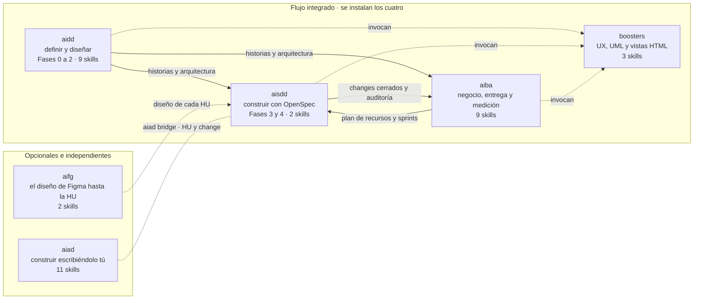

# Plugins

**¿Qué hay y cuáles instalo?** Seis plugins. Cuatro forman el flujo de principio a fin y se instalan juntos; los otros dos se añaden si te hacen falta.

## Qué instalar

| Si vas a... | Instala |
|---|---|
| Llevar un proyecto de principio a fin | `aidd`, `aisdd`, `aiba` y `boosters` |
| Solo definir y diseñar | `aidd`, con `boosters` para el prototipo y las vistas HTML |
| Solo planificar, informar y medir | `aiba` |
| Escribir tú el código, con la IA a demanda | `aiad`, solo o junto al flujo |
| Traer el diseño desde Figma | `aifg`, además del flujo |

Claude Code no resuelve dependencias entre plugins: cada uno se instala por separado. Los comandos están en el [README](../../README.md#instalación-repositorio-privado).

## Qué se pasan

| De → a | Qué | Dónde se nota |
|---|---|---|
| `aidd` → `aisdd` | Historias, arquitectura y guía de estilos | `aisdd roadmap` fasea con ellas y `aisdd implement change` lee la guía de estilos |
| `aidd` → `aiba` | Historias y arquitectura | El DF, el plan de pruebas y el plan de recursos salen del detalle de historias |
| `aiba` → `aisdd` | Plan de recursos y sprints | `aisdd roadmap` se alinea con `docs/sprint-plan.md` si existe |
| `aisdd` → `aiba` | Changes archivados y auditoría | `aiba status-report` mide el avance con ellos, y `aiba metrics` el uso de IA |
| `aifg` → `aisdd` | El diseño de cada HU | `aisdd implement change` lee `docs/design/` si existe, y si no, la guía de estilos |
| `aiad` ↔ `aisdd` | Una HU o un change | `aiad bridge` pasa la HU a change para que la construya la IA, o recupera el change para escribirlo tú |
| `aidd`, `aisdd`, `aiba` → `boosters` | Prototipos, diagramas y vistas HTML | `aidd prototype` y `aisdd prototype-ux` usan `booster-ux`; `aisdd uml`, `booster-uml`; las vistas de los documentos, `booster-docs`. Sin `boosters`, esos pasos avisan y no generan nada |

## Los seis

| Plugin | Qué cubre | Metodología |
|---|---|---|
| [`aidd`](../../plugins/aidd/) | Del brief del cliente a la arquitectura definitiva: el «qué se construye» | [AIDD-SDD](../../plugins/aidd/methodology/native-ai-aidd-sdd.md) |
| [`aisdd`](../../plugins/aisdd/) | Roadmap y ejecución change a change sobre OpenSpec, con auditoría e integración con Jira: el «cómo se construye» | [AIDD-SDD](../../plugins/aisdd/methodology/native-ai-aidd-sdd.md) |
| [`aiba`](../../plugins/aiba/) | Lo que ve el negocio: DF, plan de pruebas, planes de recursos y sprints, informe de situación, KPIs, onboarding y traspaso | [AIBA](../../plugins/aiba/methodology/native-ai-aiba.md) |
| [`boosters`](../../plugins/boosters/) | Piezas compartidas: prototipos UX, diagramas UML y vistas HTML | — |
| [`aifg`](../../plugins/aifg/) | El diseño de Figma, normalizado y vinculado a la HU que lo implementa | — |
| [`aiad`](../../plugins/aiad/) | Ejecución *human-first*: escribes tú y la IA te ayuda cuando la llamas | [AIAD](../../plugins/aiad/methodology/native-ai-aiad.md) |

Qué trae cada uno: [Skills](skills.md).
