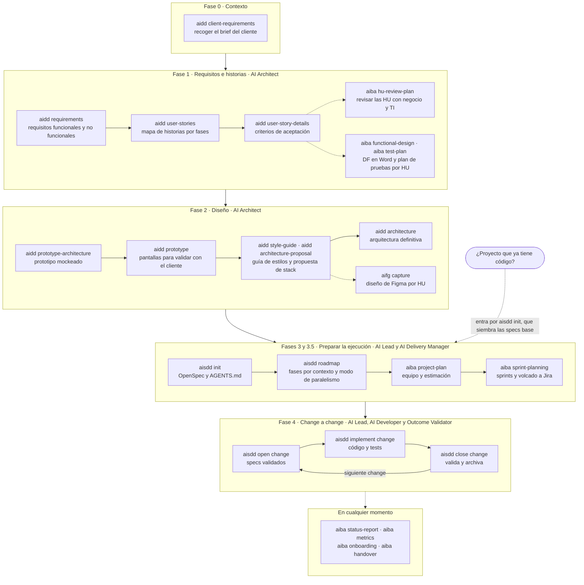
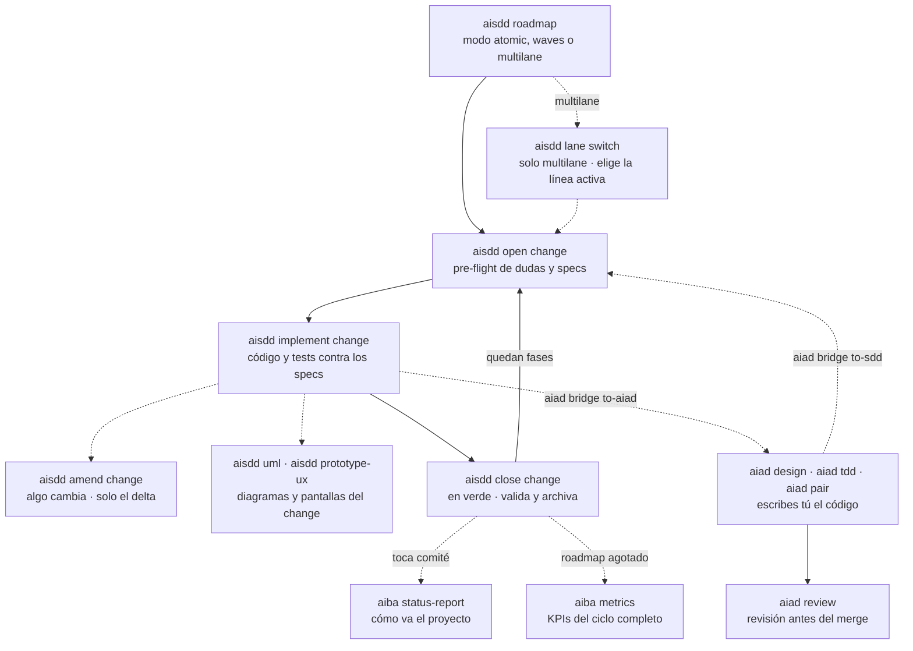

# El proceso

**¿Qué se usa en cada momento?** Del brief del cliente al último change. El primer diagrama es el recorrido completo; el segundo abre la Fase 4, que es donde se pasa la mayor parte del proyecto.

## El recorrido completo

## La Fase 4 por dentro

Cada HU se construye con uno de dos motores, y se puede cambiar a mitad: **la IA escribe** con el ciclo de `aisdd`, o **escribes tú** con `aiad`.

Qué pasa dentro de cada change, con sus roles y lo que queda escrito: [Ciclo de un change](ciclo-change.md).

## Paso a paso

| Fase | Comando | Para qué | Deja |
|---|---|---|---|
| 0 | [`aidd client-requirements`](../../plugins/aidd/skills/aidd-client-requirements/SKILL.md) | Recoger el brief del cliente | `docs/cliente-requisitos.md` |
| 1.1 | [`aidd requirements`](../../plugins/aidd/skills/aidd-requirements/SKILL.md) | Requisitos formales | `docs/requisitos.md` |
| 1.2 | [`aidd user-stories`](../../plugins/aidd/skills/aidd-user-stories/SKILL.md) | Mapa de historias por fases | `docs/mapa-historias-usuario.md` |
| 1.3 | [`aidd user-story-details`](../../plugins/aidd/skills/aidd-user-story-details/SKILL.md) | Criterios de aceptación | `docs/detalle-historias-usuario.md` |
| 1.4, opcional | [`aiba hu-review-plan`](../../plugins/aiba/skills/aiba-hu-review-plan/SKILL.md) | Revisar las HU con negocio y TI | `docs/plan-revision-hu.md` y su Excel |
| Tras la 1 | [`aiba functional-design`](../../plugins/aiba/skills/aiba-functional-design/SKILL.md) | DF en Word por HU | `docs/df/` |
| Tras la 1 | [`aiba test-plan`](../../plugins/aiba/skills/aiba-test-plan/SKILL.md) | Plan de pruebas por HU | `docs/pruebas/` |
| 2.1 | [`aidd prototype-architecture`](../../plugins/aidd/skills/aidd-prototype-architecture/SKILL.md) | Arquitectura del prototipo mockeado | `docs/arquitectura-base-prototipo.md` |
| 2.2 | [`aidd prototype`](../../plugins/aidd/skills/aidd-prototype/SKILL.md) | Pantallas del prototipo | Imágenes y HTML, con `booster-ux` |
| 2.3 | [`aidd style-guide`](../../plugins/aidd/skills/aidd-style-guide/SKILL.md) | Guía de estilos | `docs/guia-estilos.md` |
| 2.3 | [`aidd architecture-proposal`](../../plugins/aidd/skills/aidd-architecture-proposal/SKILL.md) | Propuesta de stack | `docs/propuesta-arquitectura-base.md` |
| 2.3 en adelante, opcional | [`aifg capture`](../../plugins/aifg/skills/aifg-capture/SKILL.md) | Diseño de Figma por HU | `docs/design/` |
| 2.4 | [`aidd architecture`](../../plugins/aidd/skills/aidd-architecture/SKILL.md) | Arquitectura definitiva | `docs/arquitectura-base.md` |
| 3.1 | [`aisdd init`](../../plugins/aisdd/skills/aisdd-specs/SKILL.md) | Preparar OpenSpec | `openspec/config.yaml` y `AGENTS.md` |
| 3.3 | [`aisdd roadmap`](../../plugins/aisdd/skills/aisdd-specs/SKILL.md) | Fasear por contexto | `docs/roadmap.md` |
| 3.5.1 | [`aiba project-plan`](../../plugins/aiba/skills/aiba-project-plan/SKILL.md) | Plan de recursos | `docs/planificacion-proyecto.md` |
| 3.5.2 | [`aiba sprint-planning`](../../plugins/aiba/skills/aiba-sprint-planning/SKILL.md) | Sprints y Jira | `docs/sprint-plan.md` |
| 4 | [`aisdd open change`](../../plugins/aisdd/skills/aisdd-specs/SKILL.md) | Abrir un change | `openspec/changes/<change>/` |
| 4 | [`aisdd implement change`](../../plugins/aisdd/skills/aisdd-specs/SKILL.md) | Implementarlo | Código y tests |
| 4 | [`aisdd amend change`](../../plugins/aisdd/skills/aisdd-amend/SKILL.md) | Cambiar un change abierto | El delta en specs y código |
| 4 | [`aisdd close change`](../../plugins/aisdd/skills/aisdd-specs/SKILL.md) | Validar y archivar | `openspec/specs/` y `openspec/changes/archive/` |
| 4, aux | [`aisdd lane`](../../plugins/aisdd/skills/aisdd-specs/SKILL.md), [`aisdd uml`](../../plugins/aisdd/skills/aisdd-specs/SKILL.md), [`aisdd prototype-ux`](../../plugins/aisdd/skills/aisdd-specs/SKILL.md) | Línea activa, diagramas y pantallas del change | — |
| 4, alternativa | [`aiad`](skills.md#aiad--escribirlo-tú) | Escribir tú la HU | Tu código |
| Cualquiera | [`aiba status-report`](../../plugins/aiba/skills/aiba-status-report/SKILL.md) | Cómo va el proyecto | `docs/html/estado-proyecto.html` |
| Cualquiera | [`aiba metrics`](../../plugins/aiba/skills/aiba-metrics/SKILL.md) | KPIs del uso de IA | `docs/kpis-ia.md` |
| Cualquiera | [`aiba onboarding`](../../plugins/aiba/skills/aiba-onboarding/SKILL.md) | Visión global para quien llega | `docs/onboarding.md` |
| Cualquiera | [`aiba handover`](../../plugins/aiba/skills/aiba-handover/SKILL.md) | Traspaso a mantenimiento | `docs/traspaso.md` |

Todos los comandos terminan diciendo cuál es el siguiente, con el argumento ya resuelto. El detalle de cada fase está en la [metodología AIDD-SDD](../../plugins/aidd/methodology/native-ai-aidd-sdd.md).
