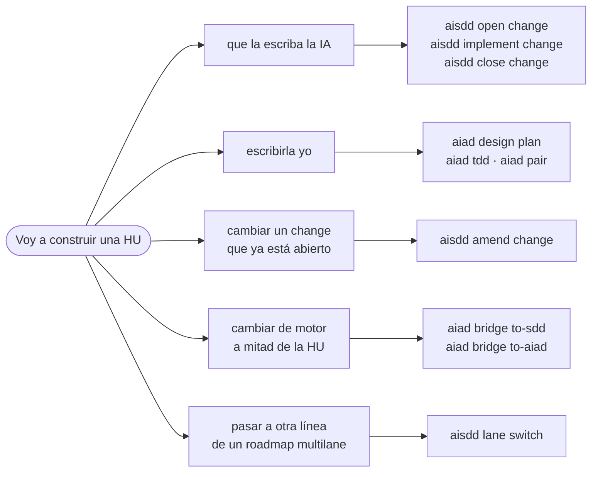
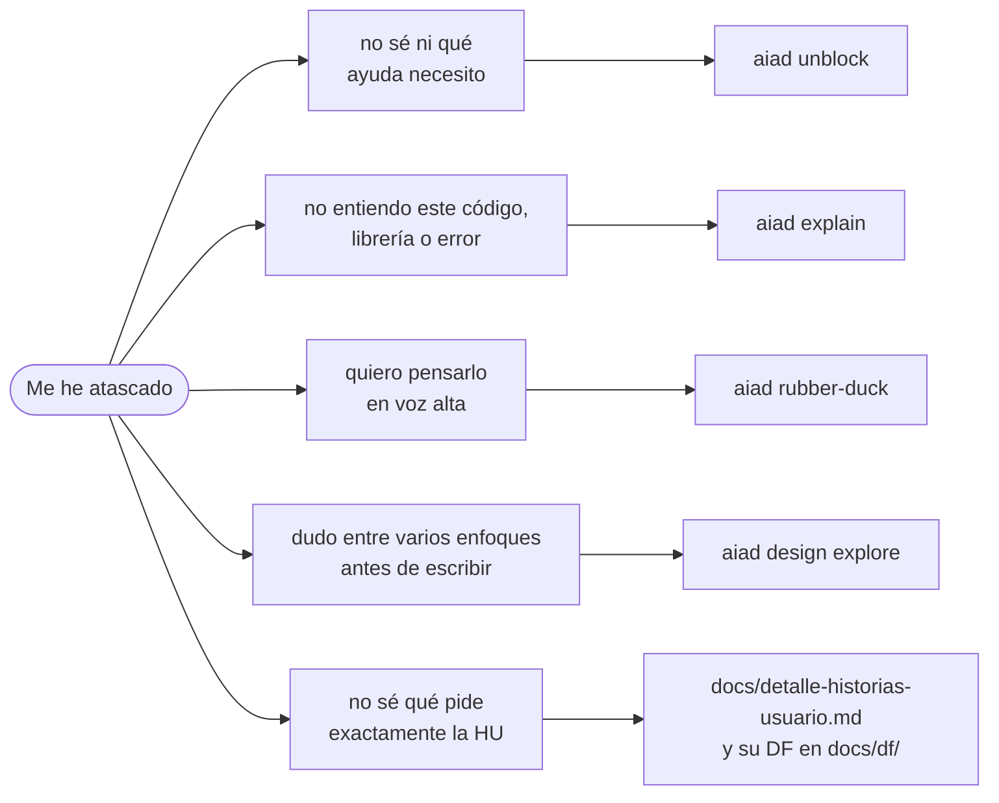
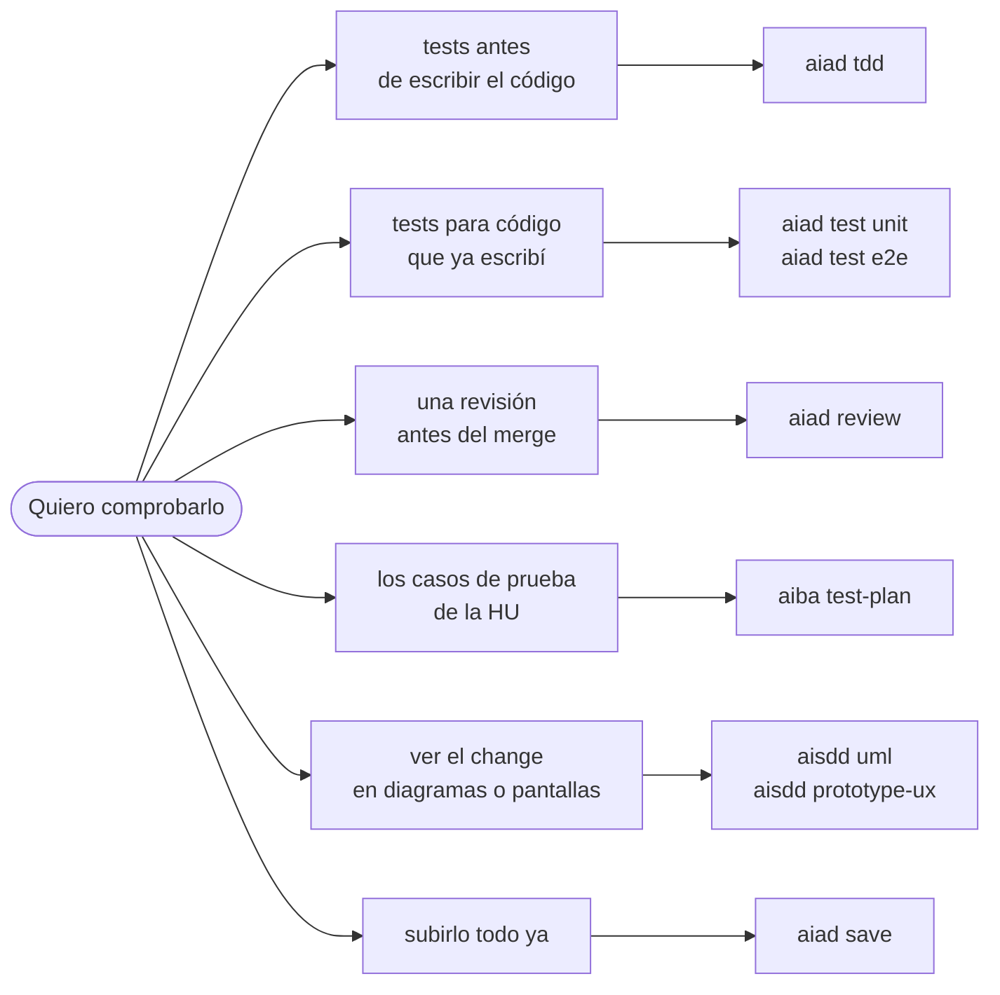
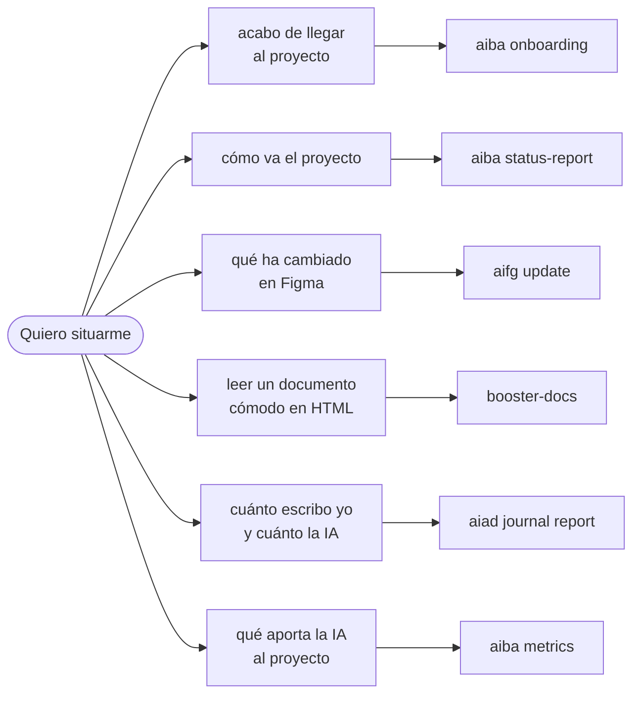

# ¿Qué uso cuando...?

**Parte de lo que te pasa, no del proceso.** Cuatro situaciones de dev a mitad de sprint; debajo de cada una, la tabla con el enlace al skill.

## Voy a construir una HU

| Quiero... | Uso | Qué hace |
|---|---|---|
| Que la escriba la IA | [`aisdd open change`, `implement change`, `close change`](../../plugins/aisdd/skills/aisdd-specs/SKILL.md) | Specs validados, código contra ellos y cierre con el change archivado |
| Escribirla yo | [`aiad design plan`](../../plugins/aiad/skills/aiad-design/SKILL.md), [`aiad tdd`](../../plugins/aiad/skills/aiad-tdd/SKILL.md), [`aiad pair`](../../plugins/aiad/skills/aiad-pair/SKILL.md) | Plan de ataque, tests en rojo que tú pones en verde, y la IA de navegante |
| Cambiar un change que ya está abierto | [`aisdd amend change`](../../plugins/aisdd/skills/aisdd-amend/SKILL.md) | Escribe el delta en los specs y ejecuta solo eso |
| Cambiar de motor a mitad de la HU | [`aiad bridge`](../../plugins/aiad/skills/aiad-bridge/SKILL.md) | `to-sdd` la pasa a change; `to-aiad` te devuelve el change como HU |
| Pasar a otra línea de un roadmap `multilane` | [`aisdd lane switch`](../../plugins/aisdd/skills/aisdd-specs/SKILL.md) | Cambia la línea activa, como `git switch` con las ramas |

## Me he atascado o no entiendo algo

| Quiero... | Uso | Qué hace |
|---|---|---|
| Salir del atasco sin saber qué necesito | [`aiad unblock`](../../plugins/aiad/skills/aiad-unblock/SKILL.md) | Hace el triaje y te lleva al skill adecuado |
| Entender código, una librería o un error | [`aiad explain`](../../plugins/aiad/skills/aiad-explain/SKILL.md) | Explica el porqué, al nivel que necesitas |
| Pensarlo en voz alta | [`aiad rubber-duck`](../../plugins/aiad/skills/aiad-rubber-duck/SKILL.md) | Te pregunta hasta que llegas a tu respuesta; no te da la solución |
| Elegir entre enfoques antes de escribir | [`aiad design explore`](../../plugins/aiad/skills/aiad-design/SKILL.md) | Abre opciones y las contrasta con criterios, sin elegir por ti |
| Saber qué pide exactamente la HU | `docs/detalle-historias-usuario.md` y el DF de [`aiba functional-design`](../../plugins/aiba/skills/aiba-functional-design/SKILL.md) | Los criterios de aceptación, y en el DF las validaciones y los mensajes |

## Quiero comprobar lo que he hecho

| Quiero... | Uso | Qué hace |
|---|---|---|
| Tests antes de escribir el código | [`aiad tdd`](../../plugins/aiad/skills/aiad-tdd/SKILL.md) | La IA escribe los tests en rojo; tú implementas |
| Tests para código que ya escribí | [`aiad test`](../../plugins/aiad/skills/aiad-test/SKILL.md) | Unitarios o e2e sobre lo que existe |
| Una revisión antes del merge | [`aiad review`](../../plugins/aiad/skills/aiad-review/SKILL.md) | Corrección, calidad o rendimiento, explicando el porqué; no toca tu código |
| Los casos de prueba de la HU | [`aiba test-plan`](../../plugins/aiba/skills/aiba-test-plan/SKILL.md) | Casos con pasos y resultado esperado, trazados al requisito |
| Ver el change en diagramas o pantallas | [`aisdd uml`, `aisdd prototype-ux`](../../plugins/aisdd/skills/aisdd-specs/SKILL.md) | UML en HTML y prototipos de pantalla del change |
| Subirlo todo ya | [`aiad save`](../../plugins/aiad/skills/aiad-save/SKILL.md) | Commit y push de todo, sin preguntas |

## Quiero situarme

| Quiero... | Uso | Qué hace |
|---|---|---|
| Situarme porque acabo de llegar | [`aiba onboarding`](../../plugins/aiba/skills/aiba-onboarding/SKILL.md) | Qué es el proyecto, cómo se trabaja, en qué sprint estamos y qué leer primero |
| Saber cómo va el proyecto | [`aiba status-report`](../../plugins/aiba/skills/aiba-status-report/SKILL.md) | Avance medido por trabajo ejecutado, bloqueos, riesgos y por qué se desvió cada change |
| Saber qué ha cambiado en Figma | [`aifg update`](../../plugins/aifg/skills/aifg-update/SKILL.md) | Vuelve a capturar lo que cambió y dice a qué historias afecta |
| Leer un documento cómodo | [`booster-docs`](../../plugins/boosters/skills/booster-docs/SKILL.md) | Vista HTML del `.md`, con índice y diagramas |
| Saber cuánto escribo yo y cuánto la IA | [`aiad journal report`](../../plugins/aiad/skills/aiad-journal/SKILL.md) | El reparto de autoría de tu bitácora |
| Saber qué aporta la IA al proyecto | [`aiba metrics`](../../plugins/aiba/skills/aiba-metrics/SKILL.md) | KPIs medidos, separando lo medido de lo estimado |
