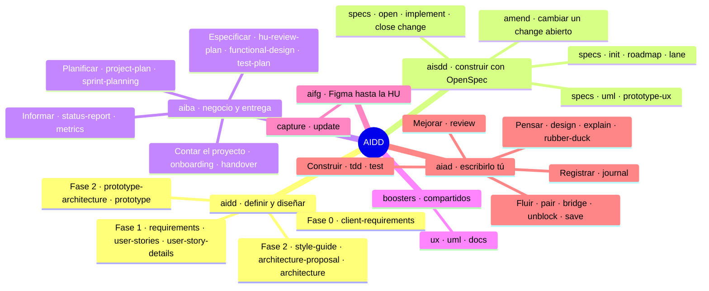

# Skills

**¿Qué trae cada plugin?** Las 36 skills de un vistazo, y debajo, una tabla por plugin con el comando y para qué sirve cada una.

Además de su comando, cada skill se puede invocar con su nombre (`/aidd:aidd-requirements`) o pidiéndolo en lenguaje natural.

## `aidd` · definir y diseñar

| Fase | Skill | Comando | Para qué |
|---|---|---|---|
| 0 | [aidd-client-requirements](../../plugins/aidd/skills/aidd-client-requirements/SKILL.md) | `aidd client-requirements` | Recoger el brief del cliente: contexto, stack, restricciones, preguntas clave y riesgos |
| 1.1 | [aidd-requirements](../../plugins/aidd/skills/aidd-requirements/SKILL.md) | `aidd requirements` | Pasar el brief a requisitos funcionales y no funcionales trazables |
| 1.2 | [aidd-user-stories](../../plugins/aidd/skills/aidd-user-stories/SKILL.md) | `aidd user-stories` | Descomponer los requisitos en un mapa de historias agrupadas por fases |
| 1.3 | [aidd-user-story-details](../../plugins/aidd/skills/aidd-user-story-details/SKILL.md) | `aidd user-story-details` | Detallar cada historia con criterios de aceptación verificables |
| 2.1 | [aidd-prototype-architecture](../../plugins/aidd/skills/aidd-prototype-architecture/SKILL.md) | `aidd prototype-architecture` | Diseñar un prototipo mockeado para validar los requisitos con el cliente |
| 2.2 | [aidd-prototype](../../plugins/aidd/skills/aidd-prototype/SKILL.md) | `aidd prototype` | Maquetar las pantallas del prototipo, una a una, con `booster-ux` |
| 2.3 | [aidd-style-guide](../../plugins/aidd/skills/aidd-style-guide/SKILL.md) | `aidd style-guide` | Guía de estilos: principios, paleta, tipografía y design tokens |
| 2.3 | [aidd-architecture-proposal](../../plugins/aidd/skills/aidd-architecture-proposal/SKILL.md) | `aidd architecture-proposal` | Proponer el stack y la arquitectura base, justificados |
| 2.4 | [aidd-architecture](../../plugins/aidd/skills/aidd-architecture/SKILL.md) | `aidd architecture` | Consolidar la arquitectura técnica definitiva e implementable |

## `aisdd` · construir con OpenSpec

| Fase | Skill | Comando | Para qué |
|---|---|---|---|
| 3.1 | [aisdd-specs](../../plugins/aisdd/skills/aisdd-specs/SKILL.md) | `aisdd init` | Inicializar OpenSpec y `AGENTS.md`; en un proyecto con código, sembrar las specs base |
| 3.3 | [aisdd-specs](../../plugins/aisdd/skills/aisdd-specs/SKILL.md) | `aisdd roadmap` | Fasear el trabajo por presupuesto de contexto y elegir el modo: `atomic`, `waves` o `multilane` |
| 4 | [aisdd-specs](../../plugins/aisdd/skills/aisdd-specs/SKILL.md) | `aisdd open change` | Abrir el siguiente change: pre-flight de dudas y specs validados |
| 4 | [aisdd-specs](../../plugins/aisdd/skills/aisdd-specs/SKILL.md) | `aisdd implement change` | Implementar el change: código y tests contra sus specs |
| 4 | [aisdd-amend](../../plugins/aisdd/skills/aisdd-amend/SKILL.md) | `aisdd amend change` | Meter una modificación en un change ya abierto y ejecutar solo ese delta |
| 4 | [aisdd-specs](../../plugins/aisdd/skills/aisdd-specs/SKILL.md) | `aisdd close change` | Comprobar que sigue en verde, validar y archivar el change |
| 4 | [aisdd-specs](../../plugins/aisdd/skills/aisdd-specs/SKILL.md) | `aisdd lane` | Elegir la línea de trabajo activa en un roadmap `multilane` |
| aux | [aisdd-specs](../../plugins/aisdd/skills/aisdd-specs/SKILL.md) | `aisdd uml` | Diagramas UML del change en HTML, con `booster-uml` |
| aux | [aisdd-specs](../../plugins/aisdd/skills/aisdd-specs/SKILL.md) | `aisdd prototype-ux` | Prototipos de pantalla del change, con `booster-ux` |

Los comandos `native-ai ...` siguen funcionando como alias.

## `aiba` · negocio y entrega

| Fase | Skill | Comando | Para qué |
|---|---|---|---|
| 1.4, opcional | [aiba-hu-review-plan](../../plugins/aiba/skills/aiba-hu-review-plan/SKILL.md) | `aiba hu-review-plan` | Planificar la revisión de las historias con negocio y TI, con su Excel |
| Tras la 1 | [aiba-functional-design](../../plugins/aiba/skills/aiba-functional-design/SKILL.md) | `aiba functional-design` | Documento de Diseño Funcional en Word, uno por historia |
| Tras la 1 | [aiba-test-plan](../../plugins/aiba/skills/aiba-test-plan/SKILL.md) | `aiba test-plan` | Plan de pruebas por historia: casos en Excel y evidencias en Word. No ejecuta las pruebas |
| 3.5.1 | [aiba-project-plan](../../plugins/aiba/skills/aiba-project-plan/SKILL.md) | `aiba project-plan` | Plan de recursos: equipo y estimación con IA frente a sin ella |
| 3.5.2 | [aiba-sprint-planning](../../plugins/aiba/skills/aiba-sprint-planning/SKILL.md) | `aiba sprint-planning` | Repartir el roadmap en sprints, con volcado opcional a Jira |
| Cualquiera | [aiba-status-report](../../plugins/aiba/skills/aiba-status-report/SKILL.md) | `aiba status-report` | Informe de situación con el avance medido por trabajo ejecutado, no por fechas |
| Cualquiera | [aiba-metrics](../../plugins/aiba/skills/aiba-metrics/SKILL.md) | `aiba metrics` | KPIs medidos del uso de IA frente al esfuerzo humano |
| Cualquiera | [aiba-onboarding](../../plugins/aiba/skills/aiba-onboarding/SKILL.md) | `aiba onboarding` | Visión global del proyecto para quien se incorpora |
| Cualquiera | [aiba-handover](../../plugins/aiba/skills/aiba-handover/SKILL.md) | `aiba handover` | Traspaso al equipo de mantenimiento: lo operativo primero y sin secretos |

## `boosters` · compartidos

Los invocan otros skills, y también se pueden llamar directamente.

| Skill | Comando | Para qué |
|---|---|---|
| [booster-ux](../../plugins/boosters/skills/booster-ux/SKILL.md) | `booster-ux` | Pantallas y prototipos en dos variantes: imagen y HTML navegable |
| [booster-uml](../../plugins/boosters/skills/booster-uml/SKILL.md) | `booster-uml` | Diagramas UML en Mermaid de un change de OpenSpec |
| [booster-docs](../../plugins/boosters/skills/booster-docs/SKILL.md) | `booster-docs` | Vista HTML de un documento de planificación; el Markdown sigue siendo la fuente |

## `aifg` · Figma hasta la HU

| Skill | Comando | Para qué |
|---|---|---|
| [aifg-capture](../../plugins/aifg/skills/aifg-capture/SKILL.md) | `aifg capture` | Extraer el diseño de Figma a `docs/design/` y vincular cada pieza a la HU que la implementa |
| [aifg-update](../../plugins/aifg/skills/aifg-update/SKILL.md) | `aifg update` | Volver a capturar lo que cambió y decir a qué historias afecta |

## `aiad` · escribirlo tú

No siguen las fases: se agrupan por intención y se usan durante la ejecución, cuando los llamas.

| Grupo | Skill | Comando | Para qué |
|---|---|---|---|
| Pensar | [aiad-design](../../plugins/aiad/skills/aiad-design/SKILL.md) | `aiad design [explore\|plan]` | Explorar opciones o planear cómo atacar una HU, sin elegir por ti |
| Pensar | [aiad-explain](../../plugins/aiad/skills/aiad-explain/SKILL.md) | `aiad explain` | Explicar código, librerías, patrones o errores al nivel que necesitas |
| Pensar | [aiad-rubber-duck](../../plugins/aiad/skills/aiad-rubber-duck/SKILL.md) | `aiad rubber-duck` | Pensar en voz alta: te pregunta hasta que llegas a tu respuesta |
| Construir | [aiad-tdd](../../plugins/aiad/skills/aiad-tdd/SKILL.md) | `aiad tdd` | La IA escribe los tests en rojo y tú implementas hasta ponerlos en verde |
| Construir | [aiad-test](../../plugins/aiad/skills/aiad-test/SKILL.md) | `aiad test [unit\|e2e]` | Tests para código que ya escribiste |
| Mejorar | [aiad-review](../../plugins/aiad/skills/aiad-review/SKILL.md) | `aiad review [correctness\|quality\|perf]` | Revisión didáctica de tu código; no aplica los arreglos |
| Fluir | [aiad-pair](../../plugins/aiad/skills/aiad-pair/SKILL.md) | `aiad pair` | Pair programming: tú escribes y la IA navega |
| Fluir | [aiad-bridge](../../plugins/aiad/skills/aiad-bridge/SKILL.md) | `aiad bridge [to-sdd\|to-aiad]` | Pasar una HU a change para que la construya la IA, o recuperar un change para escribirlo tú |
| Fluir | [aiad-unblock](../../plugins/aiad/skills/aiad-unblock/SKILL.md) | `aiad unblock` | Estás atascado y no sabes qué ayuda necesitas: te lleva al skill adecuado |
| Fluir | [aiad-save](../../plugins/aiad/skills/aiad-save/SKILL.md) | `aiad save` | Commit y push de todo, sin preguntas |
| Registrar | [aiad-journal](../../plugins/aiad/skills/aiad-journal/SKILL.md) | `aiad journal [log\|report]` | Bitácora de autoría: qué escribiste tú y qué delegaste |
