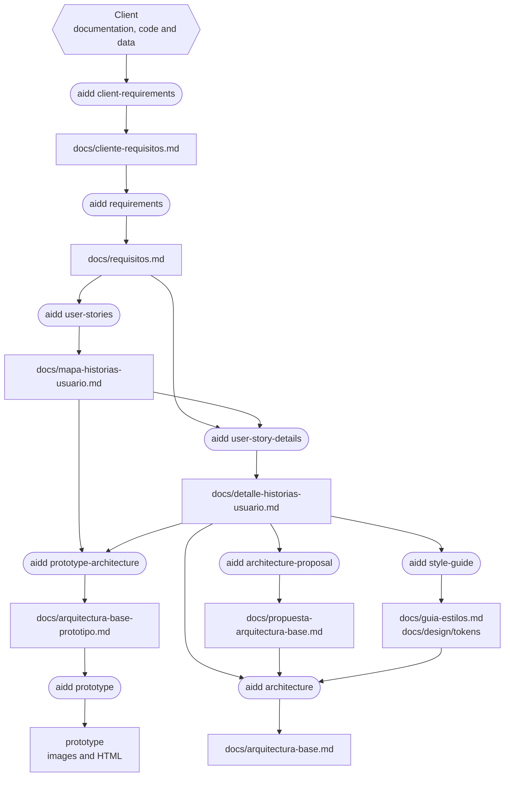
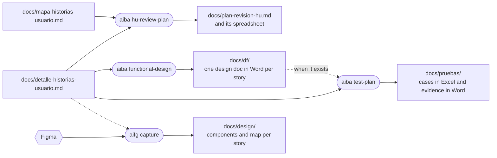
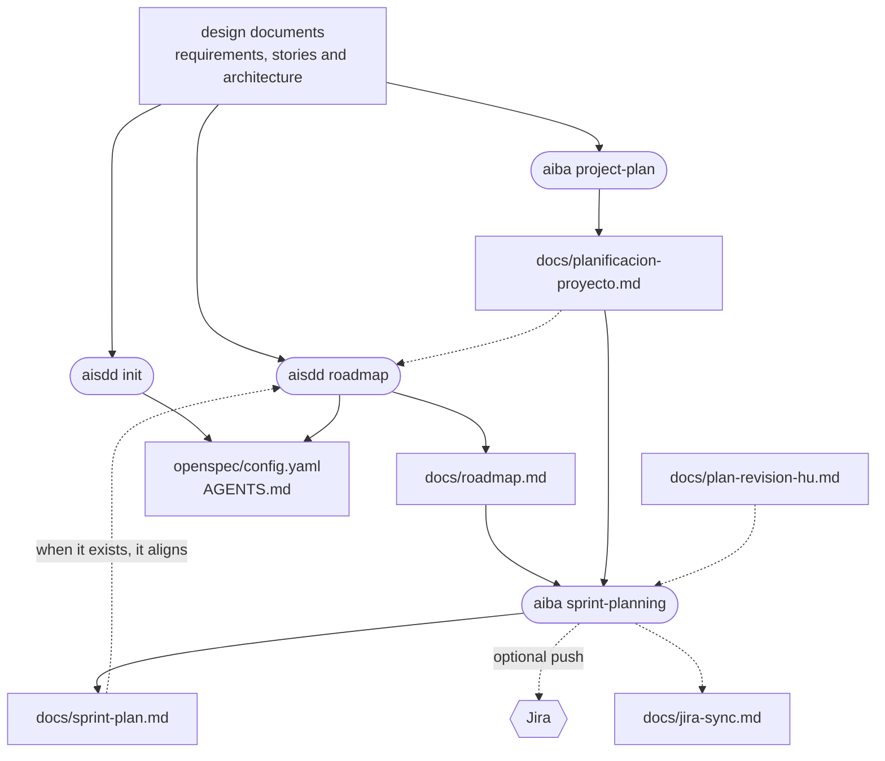
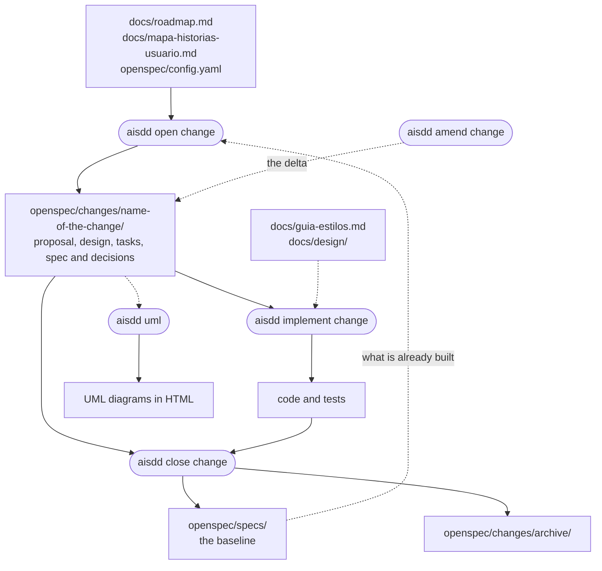
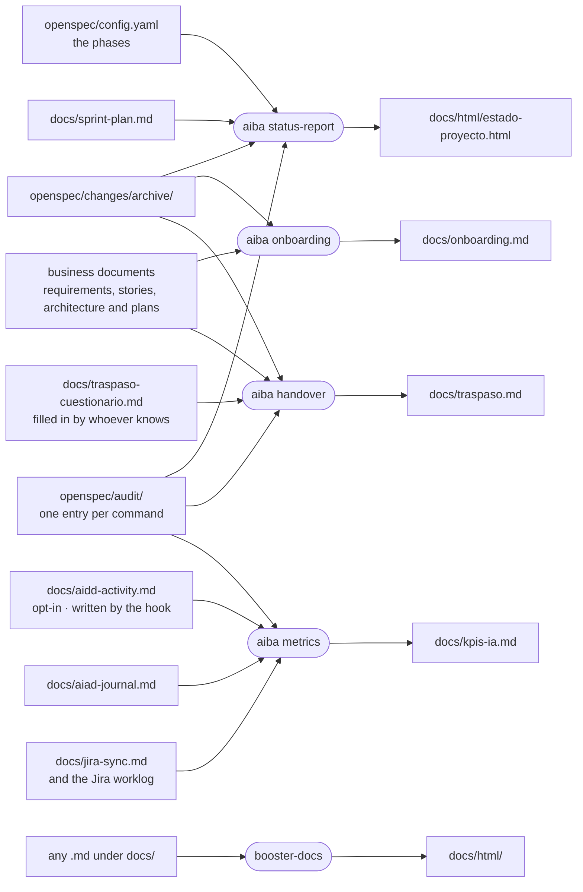

# Artifacts

> **Español:** [docs/mapas/artefactos.md](../mapas/artefactos.md). The Spanish version is the source of truth.

**Which document comes out of each step, and who reads it next?** This is what explains the order of the process: every command reads what the previous one left behind. Five diagrams, one per stretch, and at the end the table of who writes and who reads each file.

In the diagrams, a **rectangle** is a file, a **pill** is a command and a **hexagon** is something from outside the repo. File names are kept in Spanish because they are the real paths the skills read and write.

## Define and design

## What goes to business and to QA

## Plan

## Build

The three change commands also write their entry in `openspec/audit/` and, with Jira enabled, update `docs/jira-sync.md`.

## Measure and tell

## Who writes and who reads each file

| File | Written by | Read by |
|---|---|---|
| `docs/cliente-requisitos.md` | `aidd client-requirements` | `aidd requirements`, `aidd prototype`, `aiba onboarding`, `aiba handover` |
| `docs/requisitos.md` | `aidd requirements` | `aidd user-stories`, `aidd user-story-details`, `aisdd init` |
| `docs/mapa-historias-usuario.md` | `aidd user-stories` | `aidd user-story-details`, `aidd prototype-architecture`, `aiba hu-review-plan`, `aiba project-plan`, `aiba onboarding`, `aisdd open change` |
| `docs/detalle-historias-usuario.md` | `aidd user-story-details` | Nearly everything: phase 2 of `aidd`, the documents, plans and metrics of `aiba`, `aisdd init` and `aisdd roadmap`, and `aifg` |
| `docs/arquitectura-base-prototipo.md` | `aidd prototype-architecture` | `aidd prototype` |
| `docs/guia-estilos.md` | `aidd style-guide` | `aidd architecture`, `aisdd implement change`, `aifg`, `aiba onboarding`, `aiba handover` |
| `docs/design/` | `aidd style-guide` (the tokens) and `aifg capture` (components and map per story) | `aisdd implement change`, `aifg update`, `aiba handover` |
| `docs/propuesta-arquitectura-base.md` | `aidd architecture-proposal` | `aidd architecture` |
| `docs/arquitectura-base.md` | `aidd architecture` | `aisdd init`, `aisdd roadmap`, `aiba project-plan`, `aiba onboarding`, `aiba handover` |
| `docs/plan-revision-hu.md` | `aiba hu-review-plan` | `aiba sprint-planning`, `aisdd init`, `aisdd roadmap`, `aiba onboarding` |
| `docs/df/` | `aiba functional-design` | `aiba test-plan`, `aiba handover`, and whoever signs it |
| `docs/pruebas/` | `aiba test-plan` | Whoever runs the tests |
| `docs/planificacion-proyecto.md` | `aiba project-plan` | `aiba sprint-planning`, `aisdd init`, `aisdd roadmap`, `aiba onboarding`, `aiba handover` |
| `docs/roadmap.md` | `aisdd roadmap` | `aiba sprint-planning`, `aisdd open change`, `aisdd lane`, `aiba handover` |
| `docs/sprint-plan.md` | `aiba sprint-planning` | `aisdd init`, `aisdd roadmap`, `aiba status-report`, `aiba onboarding` |
| `docs/jira-sync.md` | `aiba sprint-planning` on its push, and `aisdd open`, `implement` and `close change` | Those same commands, `aisdd amend change`, `aiba functional-design` and `aiba metrics` |
| `openspec/config.yaml` | `aisdd init` and `aisdd roadmap`; `aiba sprint-planning` writes the Jira section | Every `aisdd` command, `aiba status-report` |
| `openspec/changes/<change>/` | `aisdd open change`; `aisdd implement change` and `aisdd amend change` complete it | `aisdd implement change`, `aisdd close change`, `aisdd uml` |
| `openspec/specs/` | `aisdd init` on a project with code, and `aisdd close change` | `aisdd open change`, `aiba handover` |
| `openspec/changes/archive/` | `aisdd close change` | `aiba status-report`, `aiba onboarding`, `aiba handover` |
| `openspec/audit/` | Every `aisdd` command except `aisdd lane` | `aiba status-report`, `aiba metrics`, `aiba handover` |
| `docs/aidd-activity.md` | The activity hook, only when the file already exists | `aiba metrics` |
| `docs/aiad-journal.md` | `aiad journal` and its hook | `aiba metrics` |
| `docs/html/estado-proyecto.html` | `aiba status-report` | The steering committee and management |
| `docs/kpis-ia.md` | `aiba metrics` | Whoever decides whether the AI pays off |
| `docs/onboarding.md` | `aiba onboarding` | Whoever joins, and `aiba handover` |
| `docs/traspaso-cuestionario.md` | `aiba handover` prepares it; whoever knows fills it in | `aiba handover` |
| `docs/traspaso.md` | `aiba handover` | The maintenance team |
| `docs/html/` | `booster-docs`, called by the skills that generate documents, and the `aiba` reports | People: the HTML view of each document; the `.md` stays the source |
