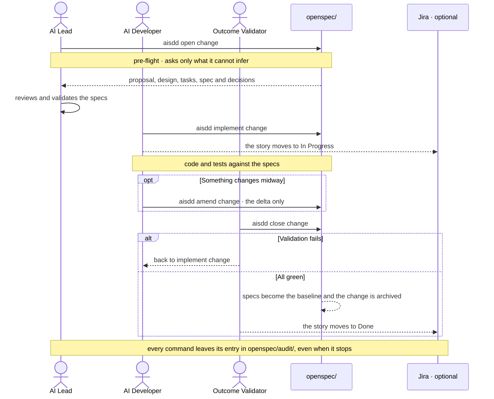

# Life of a change

> **Español:** [docs/mapas/ciclo-change.md](../mapas/ciclo-change.md). The Spanish version is the source of truth.

**Who does what, and what gets written down?** A change is OpenSpec's unit of work: it delivers one or more user stories. It goes through three commands, each one in the hands of a role, and all of them leave a trail.

## What each step writes

| Step | Role | Writes | In Jira, when enabled |
|---|---|---|---|
| `aisdd open change` | AI Lead | `proposal.md`, `design.md`, `tasks.md`, the `spec.md` files and `decisions.md` under `openspec/changes/<change>/` | Records the story in `docs/jira-sync.md` and, when the story is split across several changes, creates this change's sub-task; it moves nothing between columns |
| `aisdd implement change` | AI Developer | Code and tests; in `decisions.md`, whatever no document had settled | The Story, or the sub-task and its Story, to In Progress |
| `aisdd amend change` | AI Developer or AI Lead | The delta: new criteria in `spec.md`, the decision in `design.md`, the tasks, and their code | Moves nothing between columns: an amendment neither opens nor closes work |
| `aisdd close change` | Outcome Validator | The `spec.md` files move to `openspec/specs/` and the change to `openspec/changes/archive/` | The story to Done; in sub-task mode, only once all its sub-tasks are |

Every `aisdd` command also writes an entry in `openspec/audit/`, with status `ok`, `partial` or `aborted`, including when it stops. The only exception is `aisdd lane`, which merely moves a local pointer. That audit trail feeds [`aiba status-report`](../../plugins/aiba/skills/aiba-status-report/SKILL.md), [`aiba metrics`](../../plugins/aiba/skills/aiba-metrics/SKILL.md) and [`aiba handover`](../../plugins/aiba/skills/aiba-handover/SKILL.md).

## When something changes midway

What decides the cost is not whether the code changes, but **whether a sealed document is left saying something false**.

| Level | Situation | What you touch |
|---|---|---|
| 1 | The spec is right and the code does not meet it | The code only |
| 2 | No document had settled that detail | An entry in `decisions.md`, and you carry on |
| 3 | A sealed document states the opposite | That document, re-sealed by its own skill |
| 4 | It touches a contract shared by several lanes | Nothing on your own: a coordinated stop |

When the specs need touching too, with new criteria or tasks, the way in is [`aisdd amend change`](../../plugins/aisdd/skills/aisdd-amend/SKILL.md).

## With several lines of work

In a `multilane` roadmap there is **one open change per lane**, and each lane runs its own cycle in parallel. Barriers block every lane until they are closed, and `aisdd close change` checks that the change touched no files or specs belonging to another lane before archiving it.

## When you write the story yourself

A change is the shape a user story takes when the AI builds it. With [`aiad bridge to-sdd`](../../plugins/aiad/skills/aiad-bridge/SKILL.md) a story you were going to write enters this cycle; with `aiad bridge to-aiad` you take a change back to finish it by hand. The stable unit is always the user story.
