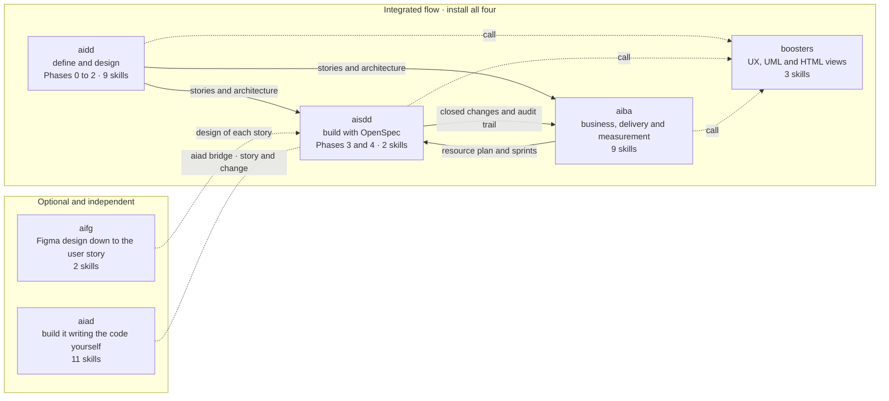

# Plugins

> **Español:** [docs/mapas/plugins.md](../mapas/plugins.md). The Spanish version is the source of truth.

**What is there, and which ones do I install?** Six plugins. Four of them make up the end-to-end flow and are installed together; the other two are added when you need them.

## What to install

| If you are going to... | Install |
|---|---|
| Run a project end to end | `aidd`, `aisdd`, `aiba` and `boosters` |
| Only define and design | `aidd`, plus `boosters` for the prototype and the HTML views |
| Only plan, report and measure | `aiba` |
| Write the code yourself, with AI on demand | `aiad`, alone or alongside the flow |
| Bring the design over from Figma | `aifg`, on top of the flow |

Claude Code does not resolve dependencies between plugins: each one is installed separately. The commands are in the [README](../../README-EN.md#installation-private-repository).

## What they hand each other

| From → to | What | Where you see it |
|---|---|---|
| `aidd` → `aisdd` | Stories, architecture and style guide | `aisdd roadmap` phases the work with them, and `aisdd implement change` reads the style guide |
| `aidd` → `aiba` | Stories and architecture | The functional design, the test plan and the resource plan all come from the story details |
| `aiba` → `aisdd` | Resource plan and sprints | `aisdd roadmap` aligns with `docs/sprint-plan.md` when it exists |
| `aisdd` → `aiba` | Archived changes and audit trail | `aiba status-report` measures progress with them, and `aiba metrics` measures AI usage |
| `aifg` → `aisdd` | The design of each story | `aisdd implement change` reads `docs/design/` when it exists, and the style guide otherwise |
| `aiad` ↔ `aisdd` | A user story or a change | `aiad bridge` turns the story into a change so the AI builds it, or takes the change back so you write it |
| `aidd`, `aisdd`, `aiba` → `boosters` | Prototypes, diagrams and HTML views | `aidd prototype` and `aisdd prototype-ux` use `booster-ux`; `aisdd uml` uses `booster-uml`; the document views use `booster-docs`. Without `boosters`, those steps warn and generate nothing |

## The six

| Plugin | What it covers | Methodology |
|---|---|---|
| [`aidd`](../../plugins/aidd/) | From the client brief to the final architecture: the "what gets built" | [AIDD-SDD](../../plugins/aidd/methodology/native-ai-aidd-sdd.md) |
| [`aisdd`](../../plugins/aisdd/) | Roadmap and change-by-change execution on OpenSpec, with an audit trail and Jira integration: the "how it gets built" | [AIDD-SDD](../../plugins/aisdd/methodology/native-ai-aidd-sdd.md) |
| [`aiba`](../../plugins/aiba/) | What the business sees: functional design, test plan, resource and sprint plans, status report, KPIs, onboarding and handover | [AIBA](../../plugins/aiba/methodology/native-ai-aiba.md) |
| [`boosters`](../../plugins/boosters/) | Shared pieces: UX prototypes, UML diagrams and HTML views | — |
| [`aifg`](../../plugins/aifg/) | The Figma design, normalised and linked to the story that implements it | — |
| [`aiad`](../../plugins/aiad/) | *Human-first* execution: you write, and the AI helps when you call it | [AIAD](../../plugins/aiad/methodology/native-ai-aiad.md) |

What each one brings: [Skills](skills.md).
