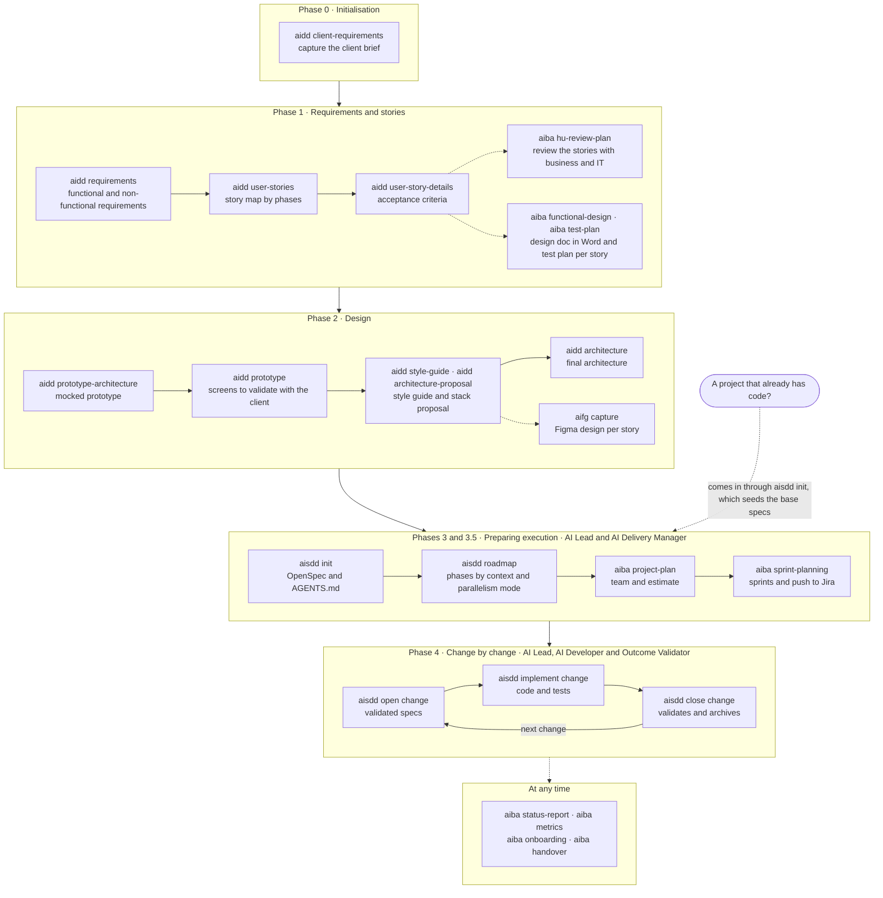
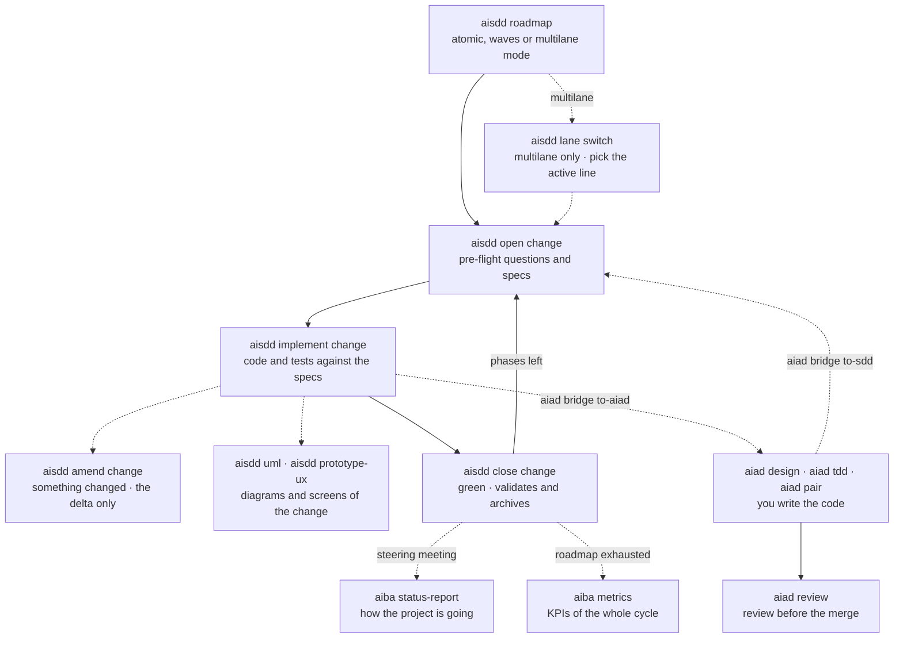

# The process

> **Español:** [docs/mapas/proceso.md](../mapas/proceso.md). The Spanish version is the source of truth.

**What is used at each point?** From the client brief to the last change. The first diagram is the whole journey; the second opens up Phase 4, where most of the project is spent.

## The whole journey

**Who.** Phase 0 is done by the team with the AI. Phases 1 and 2 belong to the AI Architect, with the `aidd` commands; the `aiba` and `aifg` steps in those phases are optional. Phase 3 belongs to the AI Lead and 3.5 to the AI Delivery Manager. In Phase 4, every change passes through AI Lead, AI Developer and Outcome Validator.

## Phase 4 from the inside

Each story is built with one of two engines, and you can switch midway: **the AI writes** with the `aisdd` cycle, or **you write** with `aiad`.

What happens inside each change, with its roles and what gets written down: [Life of a change](change-lifecycle.md).

## Step by step

| Phase | Command | What for | Leaves behind |
|---|---|---|---|
| 0 | [`aidd client-requirements`](../../plugins/aidd/skills/aidd-client-requirements/SKILL.md) | Capture the client brief | `docs/cliente-requisitos.md` |
| 1.1 | [`aidd requirements`](../../plugins/aidd/skills/aidd-requirements/SKILL.md) | Formal requirements | `docs/requisitos.md` |
| 1.2 | [`aidd user-stories`](../../plugins/aidd/skills/aidd-user-stories/SKILL.md) | Story map by phases | `docs/mapa-historias-usuario.md` |
| 1.3 | [`aidd user-story-details`](../../plugins/aidd/skills/aidd-user-story-details/SKILL.md) | Acceptance criteria | `docs/detalle-historias-usuario.md` |
| 1.4, optional | [`aiba hu-review-plan`](../../plugins/aiba/skills/aiba-hu-review-plan/SKILL.md) | Review the stories with business and IT | `docs/plan-revision-hu.md` and its spreadsheet |
| After phase 1 | [`aiba functional-design`](../../plugins/aiba/skills/aiba-functional-design/SKILL.md) | Functional design in Word, per story | `docs/df/` |
| After phase 1 | [`aiba test-plan`](../../plugins/aiba/skills/aiba-test-plan/SKILL.md) | Test plan per story | `docs/pruebas/` |
| 2.1 | [`aidd prototype-architecture`](../../plugins/aidd/skills/aidd-prototype-architecture/SKILL.md) | Architecture of the mocked prototype | `docs/arquitectura-base-prototipo.md` |
| 2.2 | [`aidd prototype`](../../plugins/aidd/skills/aidd-prototype/SKILL.md) | Prototype screens | Images and HTML, with `booster-ux` |
| 2.3 | [`aidd style-guide`](../../plugins/aidd/skills/aidd-style-guide/SKILL.md) | Style guide | `docs/guia-estilos.md` |
| 2.3 | [`aidd architecture-proposal`](../../plugins/aidd/skills/aidd-architecture-proposal/SKILL.md) | Stack proposal | `docs/propuesta-arquitectura-base.md` |
| 2.3 onwards, optional | [`aifg capture`](../../plugins/aifg/skills/aifg-capture/SKILL.md) | Figma design per story | `docs/design/` |
| 2.4 | [`aidd architecture`](../../plugins/aidd/skills/aidd-architecture/SKILL.md) | Final architecture | `docs/arquitectura-base.md` |
| 3.1 | [`aisdd init`](../../plugins/aisdd/skills/aisdd-specs/SKILL.md) | Set up OpenSpec | `openspec/config.yaml` and `AGENTS.md` |
| 3.3 | [`aisdd roadmap`](../../plugins/aisdd/skills/aisdd-specs/SKILL.md) | Phase by context | `docs/roadmap.md` |
| 3.5.1 | [`aiba project-plan`](../../plugins/aiba/skills/aiba-project-plan/SKILL.md) | Resource plan; it can run as soon as Phase 2 is approved | `docs/planificacion-proyecto.md` |
| 3.5.2 | [`aiba sprint-planning`](../../plugins/aiba/skills/aiba-sprint-planning/SKILL.md) | Sprints and Jira | `docs/sprint-plan.md` |
| 4 | [`aisdd open change`](../../plugins/aisdd/skills/aisdd-specs/SKILL.md) | Open a change | `openspec/changes/<change>/` |
| 4 | [`aisdd implement change`](../../plugins/aisdd/skills/aisdd-specs/SKILL.md) | Implement it | Code and tests |
| 4 | [`aisdd amend change`](../../plugins/aisdd/skills/aisdd-amend/SKILL.md) | Change an open change | The delta in specs and code |
| 4 | [`aisdd close change`](../../plugins/aisdd/skills/aisdd-specs/SKILL.md) | Validate and archive | `openspec/specs/` and `openspec/changes/archive/` |
| 4, aux | [`aisdd lane`](../../plugins/aisdd/skills/aisdd-specs/SKILL.md), [`aisdd uml`](../../plugins/aisdd/skills/aisdd-specs/SKILL.md), [`aisdd prototype-ux`](../../plugins/aisdd/skills/aisdd-specs/SKILL.md) | Active line, diagrams and screens of the change | — |
| 4, alternative | [`aiad`](skills.md#aiad--write-it-yourself) | Write the story yourself | Your code |
| Any | [`aiba status-report`](../../plugins/aiba/skills/aiba-status-report/SKILL.md) | How the project is going | `docs/html/estado-proyecto.html` |
| Any | [`aiba metrics`](../../plugins/aiba/skills/aiba-metrics/SKILL.md) | KPIs of AI usage | `docs/kpis-ia.md` |
| Any | [`aiba onboarding`](../../plugins/aiba/skills/aiba-onboarding/SKILL.md) | A whole-project view for whoever arrives | `docs/onboarding.md` |
| Any | [`aiba handover`](../../plugins/aiba/skills/aiba-handover/SKILL.md) | Handover to maintenance | `docs/traspaso.md` |

The `aidd`, `aisdd` and `aiba` commands all end by naming the next one; the `aisdd` ones come with the argument already resolved. The detail of each phase is in the [AIDD-SDD methodology](../../plugins/aidd/methodology/native-ai-aidd-sdd.md), in Spanish.
