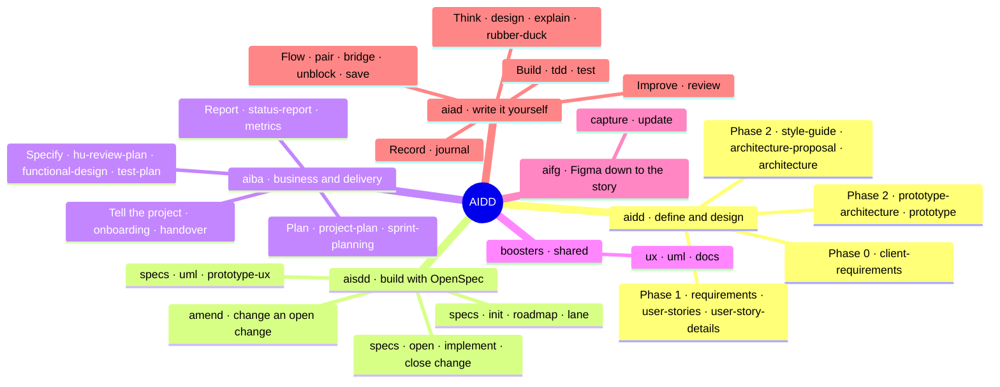

# Skills

> **Español:** [docs/mapas/skills.md](../mapas/skills.md). The Spanish version is the source of truth.

**What does each plugin bring?** Every skill at a glance, and below it, one table per plugin with the command and what each one is for.

Besides its command, every skill can be invoked by name (`/aidd:aidd-requirements`) or by asking for it in plain language.

## `aidd` · define and design

| Phase | Skill | Command | What for |
|---|---|---|---|
| 0 | [aidd-client-requirements](../../plugins/aidd/skills/aidd-client-requirements/SKILL.md) | `aidd client-requirements` | Capture the client brief: context, stack, constraints, key questions and risks |
| 1.1 | [aidd-requirements](../../plugins/aidd/skills/aidd-requirements/SKILL.md) | `aidd requirements` | Turn the brief into traceable functional and non-functional requirements |
| 1.2 | [aidd-user-stories](../../plugins/aidd/skills/aidd-user-stories/SKILL.md) | `aidd user-stories` | Break the requirements into a story map grouped by phases |
| 1.3 | [aidd-user-story-details](../../plugins/aidd/skills/aidd-user-story-details/SKILL.md) | `aidd user-story-details` | Detail each story with verifiable acceptance criteria |
| 2.1 | [aidd-prototype-architecture](../../plugins/aidd/skills/aidd-prototype-architecture/SKILL.md) | `aidd prototype-architecture` | Design a mocked prototype to validate the requirements with the client |
| 2.2 | [aidd-prototype](../../plugins/aidd/skills/aidd-prototype/SKILL.md) | `aidd prototype` | Build the prototype screens, one by one, with `booster-ux` |
| 2.3 | [aidd-style-guide](../../plugins/aidd/skills/aidd-style-guide/SKILL.md) | `aidd style-guide` | Style guide: principles, palette, typography and design tokens |
| 2.3 | [aidd-architecture-proposal](../../plugins/aidd/skills/aidd-architecture-proposal/SKILL.md) | `aidd architecture-proposal` | Propose the stack and the base architecture, with the reasoning |
| 2.4 | [aidd-architecture](../../plugins/aidd/skills/aidd-architecture/SKILL.md) | `aidd architecture` | Consolidate the final, implementable technical architecture |

## `aisdd` · build with OpenSpec

| Phase | Skill | Command | What for |
|---|---|---|---|
| 3.1 | [aisdd-specs](../../plugins/aisdd/skills/aisdd-specs/SKILL.md) | `aisdd init` | Initialise OpenSpec and `AGENTS.md`; on a project with code, seed the base specs |
| 3.3 | [aisdd-specs](../../plugins/aisdd/skills/aisdd-specs/SKILL.md) | `aisdd roadmap` | Phase the work by context budget and pick the mode: `atomic`, `waves` or `multilane` |
| 4 | [aisdd-specs](../../plugins/aisdd/skills/aisdd-specs/SKILL.md) | `aisdd open change` | Open the next change: pre-flight questions and validated specs |
| 4 | [aisdd-specs](../../plugins/aisdd/skills/aisdd-specs/SKILL.md) | `aisdd implement change` | Implement the change: code and tests against its specs |
| 4 | [aisdd-amend](../../plugins/aisdd/skills/aisdd-amend/SKILL.md) | `aisdd amend change` | Fold a modification into an open change and run that delta only |
| 4 | [aisdd-specs](../../plugins/aisdd/skills/aisdd-specs/SKILL.md) | `aisdd close change` | Check it is still green, validate and archive the change |
| 4 | [aisdd-specs](../../plugins/aisdd/skills/aisdd-specs/SKILL.md) | `aisdd lane` | Pick the active line of work in a `multilane` roadmap |
| aux | [aisdd-specs](../../plugins/aisdd/skills/aisdd-specs/SKILL.md) | `aisdd uml` | UML diagrams of the change in HTML, with `booster-uml` |
| aux | [aisdd-specs](../../plugins/aisdd/skills/aisdd-specs/SKILL.md) | `aisdd prototype-ux` | Screen prototypes of the change, with `booster-ux` |

The `native-ai ...` commands still work as aliases.

## `aiba` · business and delivery

| Phase | Skill | Command | What for |
|---|---|---|---|
| 1.4, optional | [aiba-hu-review-plan](../../plugins/aiba/skills/aiba-hu-review-plan/SKILL.md) | `aiba hu-review-plan` | Plan the story review with business and IT, with its spreadsheet |
| After phase 1 | [aiba-functional-design](../../plugins/aiba/skills/aiba-functional-design/SKILL.md) | `aiba functional-design` | Functional design document in Word, one per story |
| After phase 1 | [aiba-test-plan](../../plugins/aiba/skills/aiba-test-plan/SKILL.md) | `aiba test-plan` | Test plan per story: cases in Excel and evidence in Word. It does not run the tests |
| 3.5.1 | [aiba-project-plan](../../plugins/aiba/skills/aiba-project-plan/SKILL.md) | `aiba project-plan` | Resource plan: team and estimate with AI against without it |
| 3.5.2 | [aiba-sprint-planning](../../plugins/aiba/skills/aiba-sprint-planning/SKILL.md) | `aiba sprint-planning` | Spread the roadmap across sprints, with an optional push to Jira |
| Any | [aiba-status-report](../../plugins/aiba/skills/aiba-status-report/SKILL.md) | `aiba status-report` | Status report with progress measured by work delivered, not by dates |
| Any | [aiba-metrics](../../plugins/aiba/skills/aiba-metrics/SKILL.md) | `aiba metrics` | Measured KPIs of AI usage against human effort |
| Any | [aiba-onboarding](../../plugins/aiba/skills/aiba-onboarding/SKILL.md) | `aiba onboarding` | A whole-project view for whoever joins |
| Any | [aiba-handover](../../plugins/aiba/skills/aiba-handover/SKILL.md) | `aiba handover` | Handover to the maintenance team: operations first and no secrets |

## `boosters` · shared

Other skills call them, and they can also be called directly.

| Skill | Command | What for |
|---|---|---|
| [booster-ux](../../plugins/boosters/skills/booster-ux/SKILL.md) | `booster-ux` | Screens and prototypes in two variants: an image and navigable HTML |
| [booster-uml](../../plugins/boosters/skills/booster-uml/SKILL.md) | `booster-uml` | UML diagrams in Mermaid for an OpenSpec change |
| [booster-docs](../../plugins/boosters/skills/booster-docs/SKILL.md) | `booster-docs` | HTML view of a planning document; the Markdown stays the source |

## `aifg` · Figma down to the story

| Skill | Command | What for |
|---|---|---|
| [aifg-capture](../../plugins/aifg/skills/aifg-capture/SKILL.md) | `aifg capture` | Extract the Figma design into `docs/design/` and link each piece to the story that implements it |
| [aifg-update](../../plugins/aifg/skills/aifg-update/SKILL.md) | `aifg update` | Re-capture what changed and say which stories it affects |

## `aiad` · write it yourself

These do not follow the phases: they are grouped by intent and used during execution, whenever you call them.

| Group | Skill | Command | What for |
|---|---|---|---|
| Think | [aiad-design](../../plugins/aiad/skills/aiad-design/SKILL.md) | `aiad design [explore\|plan]` | Explore options or plan how to tackle a story, without choosing for you |
| Think | [aiad-explain](../../plugins/aiad/skills/aiad-explain/SKILL.md) | `aiad explain` | Explain code, libraries, patterns or errors at the level you need |
| Think | [aiad-rubber-duck](../../plugins/aiad/skills/aiad-rubber-duck/SKILL.md) | `aiad rubber-duck` | Think out loud: it asks until you reach your own answer |
| Build | [aiad-tdd](../../plugins/aiad/skills/aiad-tdd/SKILL.md) | `aiad tdd` | The AI writes the failing tests and you implement until they go green |
| Build | [aiad-test](../../plugins/aiad/skills/aiad-test/SKILL.md) | `aiad test [unit\|e2e]` | Tests for code you already wrote |
| Improve | [aiad-review](../../plugins/aiad/skills/aiad-review/SKILL.md) | `aiad review [correctness\|quality\|perf]` | A teaching review of your code; it does not apply the fixes |
| Flow | [aiad-pair](../../plugins/aiad/skills/aiad-pair/SKILL.md) | `aiad pair` | Pair programming: you drive and the AI navigates |
| Flow | [aiad-bridge](../../plugins/aiad/skills/aiad-bridge/SKILL.md) | `aiad bridge [to-sdd\|to-aiad]` | Turn a story into a change so the AI builds it, or take a change back to write it yourself |
| Flow | [aiad-unblock](../../plugins/aiad/skills/aiad-unblock/SKILL.md) | `aiad unblock` | You are stuck and do not know what help you need: it routes you to the right skill |
| Flow | [aiad-save](../../plugins/aiad/skills/aiad-save/SKILL.md) | `aiad save` | Commit and push of everything, no questions asked |
| Record | [aiad-journal](../../plugins/aiad/skills/aiad-journal/SKILL.md) | `aiad journal [log\|report]` | Authorship journal: what you wrote and what you delegated |
