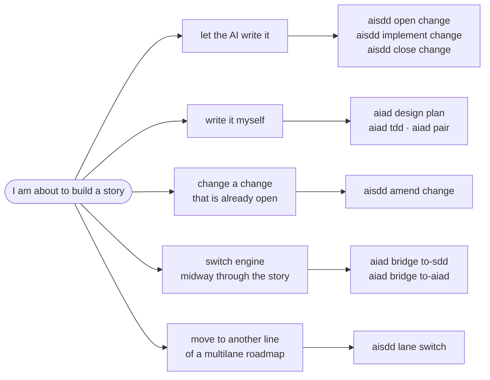
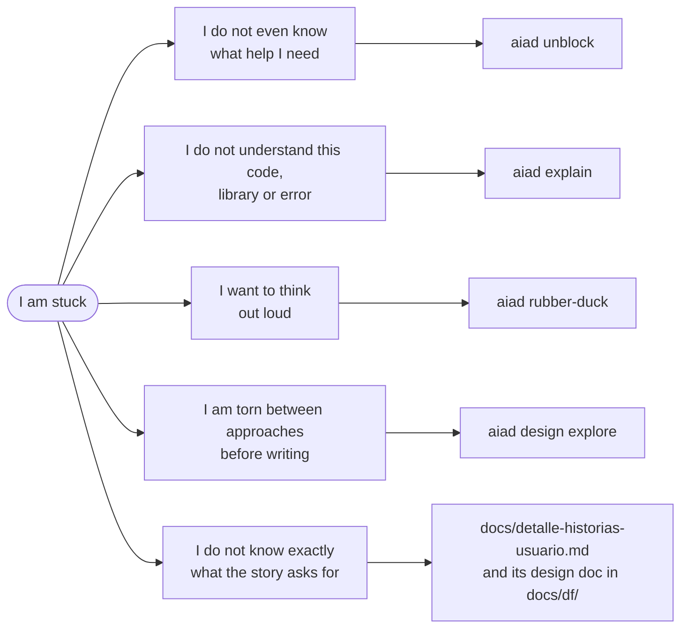
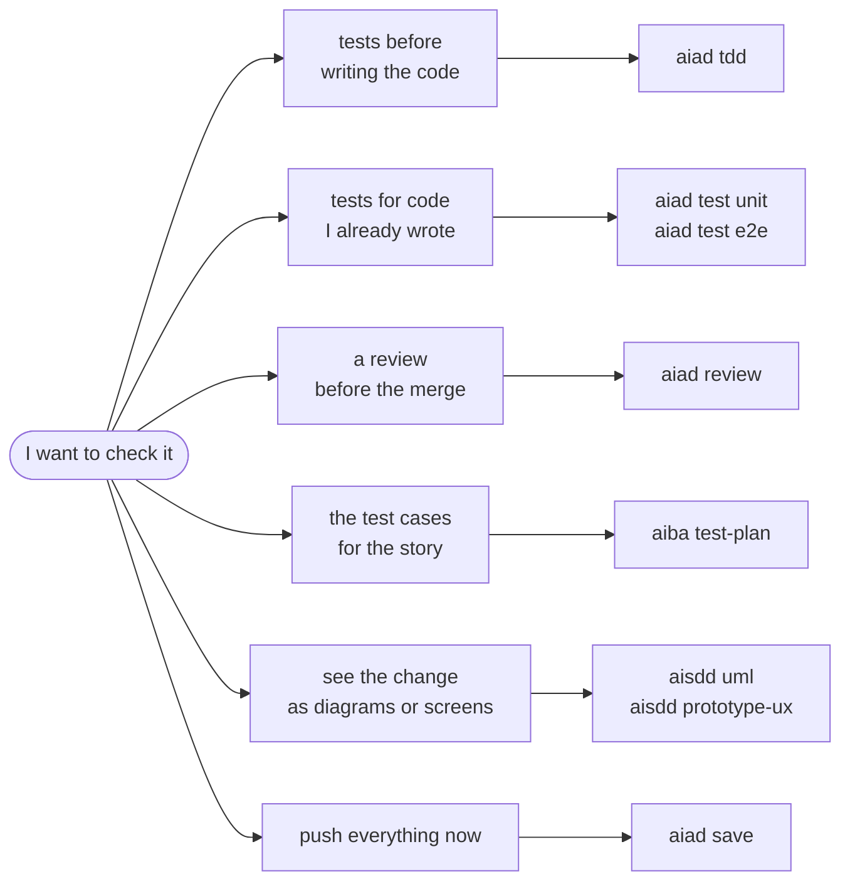
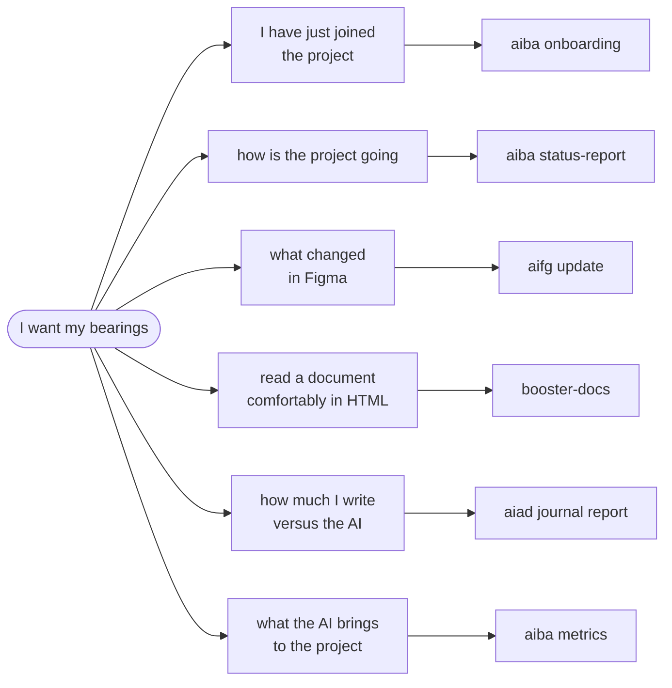

# What do I use when...?

> **Español:** [docs/mapas/que-uso-cuando.md](../mapas/que-uso-cuando.md). The Spanish version is the source of truth.

**It starts from what is happening to you, not from the process.** Four situations a dev hits mid-sprint; under each one, the table with the link to the skill.

## I am about to build a user story

| I want to... | I use | What it does |
|---|---|---|
| Let the AI write it | [`aisdd open change`, `implement change`, `close change`](../../plugins/aisdd/skills/aisdd-specs/SKILL.md) | Validated specs, code against them, and a close that archives the change |
| Write it myself | [`aiad design plan`](../../plugins/aiad/skills/aiad-design/SKILL.md), [`aiad tdd`](../../plugins/aiad/skills/aiad-tdd/SKILL.md), [`aiad pair`](../../plugins/aiad/skills/aiad-pair/SKILL.md) | A plan of attack, red tests you turn green, and the AI as navigator |
| Change a change that is already open | [`aisdd amend change`](../../plugins/aisdd/skills/aisdd-amend/SKILL.md) | Writes the delta into the specs and runs just that |
| Switch engine midway through the story | [`aiad bridge`](../../plugins/aiad/skills/aiad-bridge/SKILL.md) | `to-sdd` turns it into a change; `to-aiad` hands the change back to you as a story |
| Move to another line of a `multilane` roadmap | [`aisdd lane switch`](../../plugins/aisdd/skills/aisdd-specs/SKILL.md) | Switches the active line, the way `git switch` does with branches |

## I am stuck, or I do not understand something

| I want to... | I use | What it does |
|---|---|---|
| Get unstuck without knowing what I need | [`aiad unblock`](../../plugins/aiad/skills/aiad-unblock/SKILL.md) | Triages the blocker and routes you to the right skill |
| Understand code, a library or an error | [`aiad explain`](../../plugins/aiad/skills/aiad-explain/SKILL.md) | Explains the why, at the level you need |
| Think it through out loud | [`aiad rubber-duck`](../../plugins/aiad/skills/aiad-rubber-duck/SKILL.md) | Asks until you reach your own answer; it does not hand you the solution |
| Choose between approaches before writing | [`aiad design explore`](../../plugins/aiad/skills/aiad-design/SKILL.md) | Opens up options and contrasts them against criteria, without choosing for you |
| Know exactly what the story asks for | `docs/detalle-historias-usuario.md` and the functional design from [`aiba functional-design`](../../plugins/aiba/skills/aiba-functional-design/SKILL.md) | The acceptance criteria, and in the functional design the validations and messages |

## I want to check what I have done

| I want to... | I use | What it does |
|---|---|---|
| Tests before writing the code | [`aiad tdd`](../../plugins/aiad/skills/aiad-tdd/SKILL.md) | The AI writes the failing tests; you implement |
| Tests for code I already wrote | [`aiad test`](../../plugins/aiad/skills/aiad-test/SKILL.md) | Unit or end-to-end tests over what exists |
| A review before the merge | [`aiad review`](../../plugins/aiad/skills/aiad-review/SKILL.md) | Correctness, quality or performance, explaining the why; it does not touch your code |
| The test cases for the story | [`aiba test-plan`](../../plugins/aiba/skills/aiba-test-plan/SKILL.md) | Cases with steps and expected result, traced back to the requirement |
| See the change as diagrams or screens | [`aisdd uml`, `aisdd prototype-ux`](../../plugins/aisdd/skills/aisdd-specs/SKILL.md) | UML in HTML and screen prototypes of the change |
| Push everything now | [`aiad save`](../../plugins/aiad/skills/aiad-save/SKILL.md) | Commit and push of everything, no questions asked |

## I want to get my bearings

| I want to... | I use | What it does |
|---|---|---|
| Get my bearings after joining | [`aiba onboarding`](../../plugins/aiba/skills/aiba-onboarding/SKILL.md) | What the project is, how the team works, which sprint we are in and what to read first |
| Know how the project is going | [`aiba status-report`](../../plugins/aiba/skills/aiba-status-report/SKILL.md) | Progress measured by work delivered, blockers, risks and why each change slipped |
| Know what changed in Figma | [`aifg update`](../../plugins/aifg/skills/aifg-update/SKILL.md) | Re-captures what changed and says which stories it affects |
| Read a document comfortably | [`booster-docs`](../../plugins/boosters/skills/booster-docs/SKILL.md) | An HTML view of the `.md`, with a table of contents and diagrams |
| Know how much I write versus the AI | [`aiad journal report`](../../plugins/aiad/skills/aiad-journal/SKILL.md) | The authorship split from your journal |
| Know what the AI brings to the project | [`aiba metrics`](../../plugins/aiba/skills/aiba-metrics/SKILL.md) | Measured KPIs, keeping what is measured apart from what is estimated |
